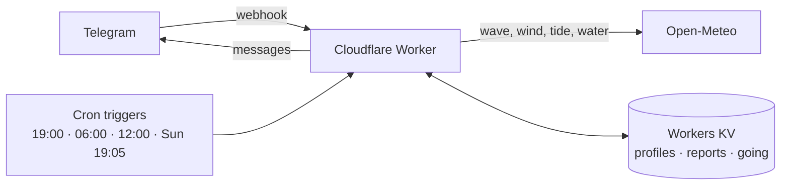

<h1 align="center">🏄 Should I Work Today?</h1>

<p align="center">
  A private Telegram bot that tells a group of friends, every evening, whether to go to work tomorrow — or go surfing.<br>
  One Cloudflare Worker: no server, no database, no runtime dependency, and it fits in the free plan.
</p>

<p align="center">
  <a href="https://github.com/DamienMERCIER/should-I-work-today/actions/workflows/ci.yml"></a>
  
  
  
  
  
</p>

---

## What it looks like

Every evening at 19:00, each friend gets tomorrow's verdict for the spots within 20 km of them.

```text
🟢 DON'T GO TO WORK TOMORROW (Wed 16 Sept) — it's firing

🏄 Kommetjie – Long Beach · 7:00–12:00 · ⭐⭐⭐⭐⭐⭐
   3.5 m · SW 13 s · offshore SE 8 kt · incoming tide, high 9:00
   ☀️ 22° · sunrise 6:44
   🌡️ water 13° · 5/4 wetsuit + booties
🕐 6  9  12 15 18
🌊 ·▆▆▆▆▅▂······
⭐ ·━━━━━━······

[ 🙋 Long Beach ] [ 📍 ]     [ 📋 All spots ]
```

Nothing worth it? The message says so, and still names the best spots of the day, so you can judge for yourself.

```text
🔴 GO TO WORK TOMORROW (Fri 18 Sept)

Nothing ≥ 4★ within 20 km.

🥇 Glen Beach ⭐⭐⭐ (swell 1.6 m)
   🌡️ water 12° · 5/4 wetsuit + booties

🥈 Llandudno ⭐⭐⭐ (swell 1.6 m)
```

Reading it: **⭐ yellow stars** are clean waves, **☆ white** ones are spoilt by a cross or onshore wind — the
distinction surf-forecast makes. Under a spot, `🕐` is the hour ruler, `🌊` the level of each hour, and `⭐` marks
the hours whose stars are yellow.

## What it does

| | |
|---|---|
| 🕖 **19:00** | Tomorrow's verdict: the best window, its conditions, the day's curve, the water temperature and the wetsuit to take. |
| 🌅 **06:00** | A short confirmation, or a correction — only when there is a surf day at stake. |
| 🔥 **12:00** | A heads-up when an exceptional day (6★ or more) is coming in two or three days, early enough to book the day off. |
| 📅 **Sunday 19:05** | The week ahead, best day first. |
| 🙋 **Any time** | Tap a spot under a forecast to say you are going, and see who else is. |
| 🔎 **`/now`** | The rest of today, recomputed on the spot; after dark it rolls over to tomorrow. |
| 📍 **Your location** | Send it and the bot switches to the spots around you; `🏠` brings it back home. |

Each friend sets their own work hours and their own bar — 3★ to 6★ — so the same day can be a 🟢 for one and a 🔴 for
another. The bot speaks English and Russian, picked from the Telegram client and changeable with `/lang`.

## Commands

| Command | What it does |
|---|---|
| `/now` | The rest of the day, or tomorrow once the light has gone. |
| `/week` | The week ahead, best day first. |
| `/all` | Every spot around you, hour by hour, with a button per spot. |
| `/<spot>` | One spot's day — e.g. `/long_beach`, derived from its short name. |
| `/profile` | Work hours, and the stars you get up for. |
| `/lang` | English or Russian. |
| `/about` | What the bot is, and where its data comes from. |
| `/stop` | No more messages; `/start` brings them back. |
| `/friends` | Admin only: who is in, where, with which hours, and who left. |
| `/letin <id> [en\|ru]` | Admin only: let someone in without the invite link — the id is in the notification. |

## How the stars are decided

The rating reproduces what surf-forecast.com shows for the same spot and hour, so a friend who cross-checks sees the
same number: a base score from the swell that actually reaches the spot, times a wind factor that depends on the
wind's angle to the shore. No level, no board, no tide in the number — the same stars for everyone.

[`docs/rating.md`](docs/rating.md) explains the reconstruction: the measurements behind it, how close it lands, and
what it deliberately ignores. `npm run compare:sf` keeps measuring the gap, spot by spot and hour by hour.

## How it runs



One invocation per cron serves the whole group: the forecast is fetched once per region, each spot's day is rated
once, and friends who share a place, hours, language and bar share one rendered message. That is what keeps a run
inside the ceilings below.

| Free-plan ceiling | What the bot uses |
|---|---|
| 10 ms CPU per invocation | 2.7 ms in the evening, 2.2 ms in the morning, 2.8 ms at noon, 5.3 ms on Sunday — measured with 40 friends over two areas |
| 50 external subrequests per invocation | 3 per region plus one message per friend, capped at 47: about 44 friends in one area, the newest deferred to the next run |
| 1,000 KV writes a day | Two report writes per run, one per profile change, one per 🙋 tap |
| 100,000 requests a day | One per Telegram update, plus four crons |
| Open-Meteo, 10,000 calls a day | One load per region and day, shared by every friend nearby |

## Run your own

```bash
nvm use             # Node 22 — wrangler 4 needs it
npm install
npm test            # 651 tests, no network
npm run typecheck
npm run check:spots # the spots and regions, validated
npm run report      # tonight's message, on live data, printed in the terminal
npm run dev         # wrangler dev --test-scheduled
```

Then, once:

1. **The bot.** BotFather → `/newbot` → token. `/setcommands` with the list above, leaving `/friends` and `/letin` out — they are yours.
2. **Storage.** `npx wrangler login`, then `npx wrangler kv namespace create KV`, and put the id it prints in
   `wrangler.toml`. To keep it out of git — the way this repository does — copy the file to `wrangler.local.toml`
   (git-ignored) instead, and pass `--config wrangler.local.toml` when you deploy.
3. **Secrets.** `npx wrangler secret put` for `TELEGRAM_BOT_TOKEN`, `WEBHOOK_SECRET` (`openssl rand -hex 24`),
   `INVITE_CODE` (**required** — without it every `/start` is refused; make it random, `openssl rand -hex 8`, since
   nothing rate-limits a wrong guess) and `ADMIN_CHAT_ID` (your own chat id).
4. **Deploy.** `npm run deploy` (or `npx wrangler deploy --config wrangler.local.toml` with the local config).
5. **Webhook.** `TELEGRAM_BOT_TOKEN=… WEBHOOK_SECRET=… WORKER_URL=https://… npm run set-webhook`.
6. **Invite.** Share `https://t.me/<bot>?start=<INVITE_CODE>` and tap `🔎 Right now`.

Local variables for `npm run dev` go in `.dev.vars` (git-ignored): the same four names. The default home is
Muizenberg, Cape Town, with a 20 km radius (`src/config.ts`); anyone who sends their location gets the spots around
them instead.

## Operating it

- **The 19:00 push is the heartbeat.** Any failure in a run reaches `ADMIN_CHAT_ID` on Telegram, as does every friend
  who joins, every refused invite, and every stranger who writes without one. The last two carry a **✅ Let in**
  button: one tap, and they get the same profile and welcome as the invite link would have given them.
- **Logs**: `npx wrangler tail`.
- **A run that died holding its lock**: `npx wrangler kv key delete --binding KV "run:<date>:evening"` (or `morning`,
  `week`, `alert`) before running it again.
- **KV keys**: `profile:<chatId>` (a copy in metadata, so one `list` reads everyone), `reports:<date>` (each spot-day
  stored once), `going:<date>:<chatId>` (3 days), `alerted:<date>:<chatId>` (5 days), `run:<date>:<kind>` (the lock).
- **Calibration**: run `npm run compare:sf` daily for a few weeks. The CSV puts the site's stars, heights and wind
  next to the bot's, spot by spot. The rating constants live in `src/engine/rating.ts`, the verdict thresholds in
  `src/config.ts`, and each spot's facing in `src/data/spots.json`.

## The spots

`src/data/spots.json` holds 35 hand-checked South African spots: the direction each faces, the swell window it
accepts, how much open-ocean swell reaches it, the tides it likes. `src/data/spots-world.json` holds 6,183 more,
imported from surf-forecast.com's public pages by `scripts/import-spots.ts` — names, coordinates and facing only, and
never one closer than 20 km to a curated spot. [`NOTICE.md`](NOTICE.md) says where all of it comes from and how to
treat it.

Known limit: abroad, each imported spot sits in its own forecast region, three subrequests each, so a dense cluster
(Hossegor and its 46 breaks) would ask for more than one invocation may make. Cape Town is unaffected — the curated
spots share one region.

## Layout

```text
src/
  adapters/   Telegram, Open-Meteo, Workers KV — the only places that talk to the outside
  bot/        the router: commands, buttons, callbacks, profiles
  engine/     pure functions: rating, windows, verdict, tide, water, daylight
  jobs/       what a cron does: collect the forecast, decide, send
  render/     the messages, in English and Russian, and the day chart
  data/       spots, regions, and the imported world list
scripts/      the spot import, the surf-forecast comparison, one-off tools
test/         651 tests, no network: a golden day, fixtures, and every message asserted
docs/         how the rating was reconstructed
```

Every message the bot can send is asserted somewhere in `test/`, character for character, in both languages — that is
how a two-line change to a forecast message stays safe.

Comments sometimes cite a `§` section of the design notes, which live outside this repository. Each of them states the
rule it refers to, so nothing here needs those notes to be understood.

## Credits

Forecasts by [Open-Meteo](https://open-meteo.com) — data under CC-BY 4.0, read through its free non-commercial
tier. Ratings reconstructed from [surf-forecast.com](https://www.surf-forecast.com) pages. Code under the MIT
licence, data as described in [`NOTICE.md`](NOTICE.md).
